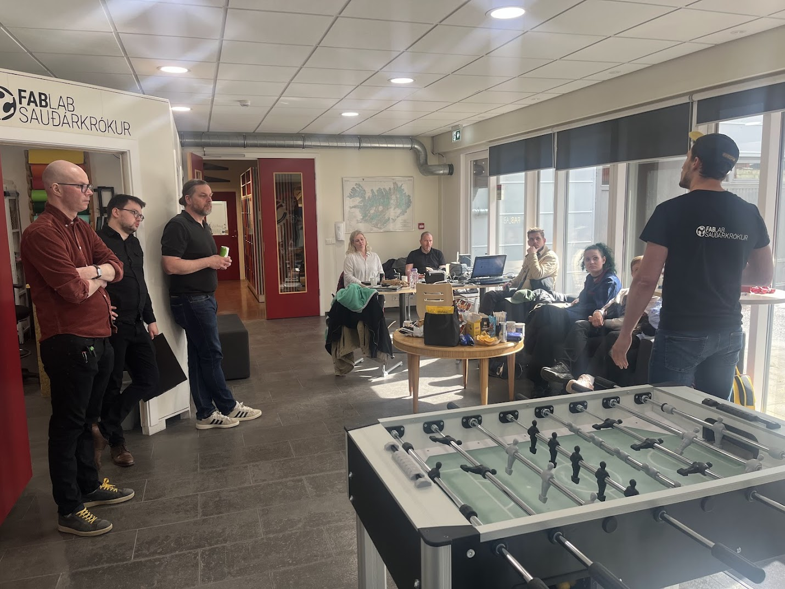
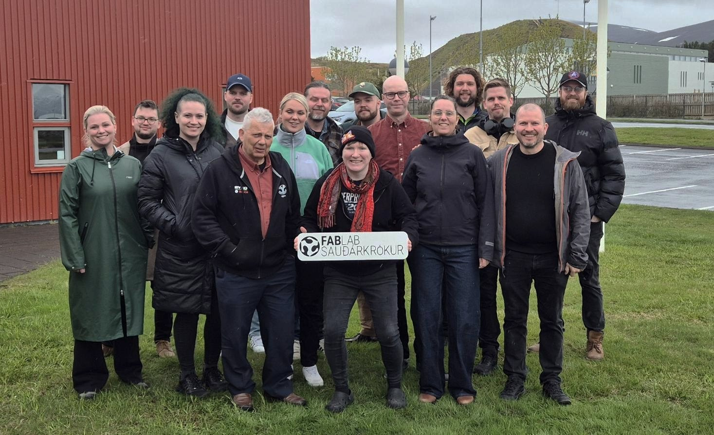

---
hide:
  - navigation
 # - toc
  - path
---
# Bootcamp Sauðárkrókur 2026

Árlega hittast allar Fab Lab smiðjur á Íslandi til að efla samstarf, miðla þekkingu og þróa nýjar hugmyndir. Við köllum það **Bootcamp**

<!-- {width=70%} -->
///caption
Karítas forstöðumaður fab Lab Sauðárkrókar býður ykkur velkomin!
///

## Bootcamp fyrri ára

📍 **[2024 – Húsavík](https://fab-lab-island.github.io/fli-bootcamp-2025/)** 
📍 **[2024 – Selfoss](https://fab-lab-island.github.io/fli-bootcamp-2024/)** 
📍 **[2023 – Neskaupstaður](https://fab-lab-island.github.io/fli-bootcamp-2023/)**   
📍 **[2022 – Ísafjörður]()** 
📍 **[2021 – Höfn í Hornafirði]()** 
📍 **[2020 – Akureyri]()** 
📍 **[2019 – Vestmanneyjar]()** 
📍 **[2018 – Sauðárkrókur]()** 

[fablab.is](https://fablab.is/)
