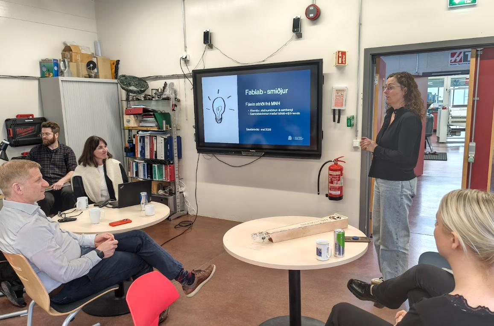

# Heimsókn Ráðuneytis

Á Fab Lab Ísland Bootcamp 2026 fengum við heimsókn frá fulltrúum Menningar-, nýsköpunar- og háskólaráðuneytisins, þeim Lóu Auðunsdóttur og Óla Halldórssyni.

Heimsóknin skapaði gott tækifæri til samtals um stöðu Fab Lab smiðjanna á Íslandi, hlutverk þeirra í STEM menntun, nýsköpun og samfélagsþróun og þau tækifæri sem felast í áframhaldandi uppbyggingu smiðjunetsins.

## Kynning frá ráðuneytinu

Lóa og Óli kynntu niðurstöður könnunar sem ráðuneytið hafði unnið og fóru yfir helstu áherslur og áskoranir á sviði menntunar, nýsköpunar og tækniþróunar. Í kjölfarið sköpuðust góðar umræður milli þátttakenda og fulltrúa ráðuneytisins.

## Kynningar frá Fab Lab smiðjunum

Starfsmenn Fab Lab smiðjanna kynntu verkefni og starfsemi úr sínum heimabyggðum. Þar gafst tækifæri til að sýna fjölbreytni verkefna innan netverksins og hvernig smiðjurnar styðja við STEM menntun, frumkvöðlastarfsemi, nýsköpun og samfélagsverkefni um land allt.

{ type=application/pdf style="width:100%; height:520px; border:none;" }

[Fab Lab starfsemi fólk og verkefni - kynning](./assets/Fab_Lab_Ísland_sögur_um_fólk_og_verkefni.pdf)

## Fab Lab Ísland

Einnig var haldin kynning á Fab Lab Íslandi þar sem farið var yfir sögu netverksins, samstarf smiðjanna og framtíðarsýn. Kynnt voru verkefni sem hafa verið unnin víðs vegar um landið og hvernig Fab Lab smiðjurnar skapa aðgengi að tækni, verklegu námi og skapandi lausnaleit fyrir fólk á öllum aldri.

{ type=application/pdf style="width:100%; height:520px;" }

## Samantekt

Heimsóknin var bæði gagnleg og áhugaverð fyrir alla þátttakendur. Slík samskipti skapa verðmæt tækifæri til að miðla reynslu, deila hugmyndum og efla tengsl milli Fab Lab samfélagsins og stjórnvalda.

Við þökkum Lóu og Óla kærlega fyrir heimsóknina, góðar umræður og áhugann á starfsemi Fab Lab Íslands.
