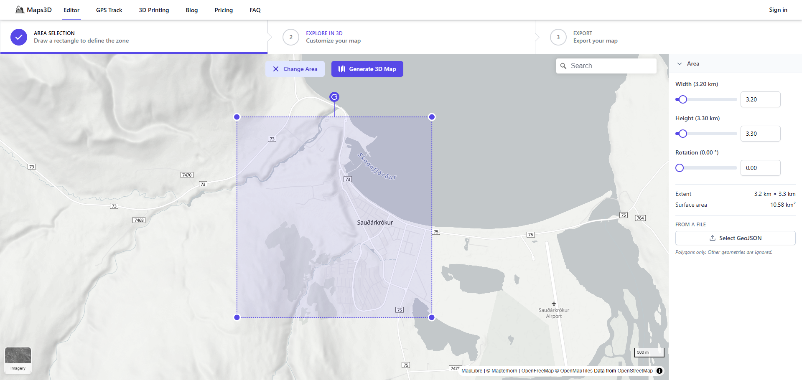
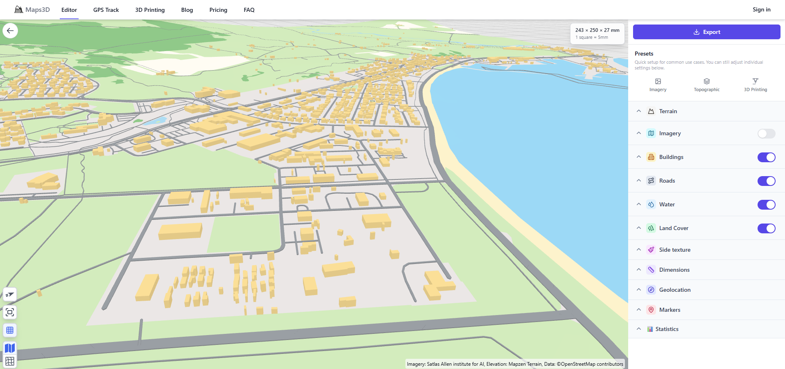
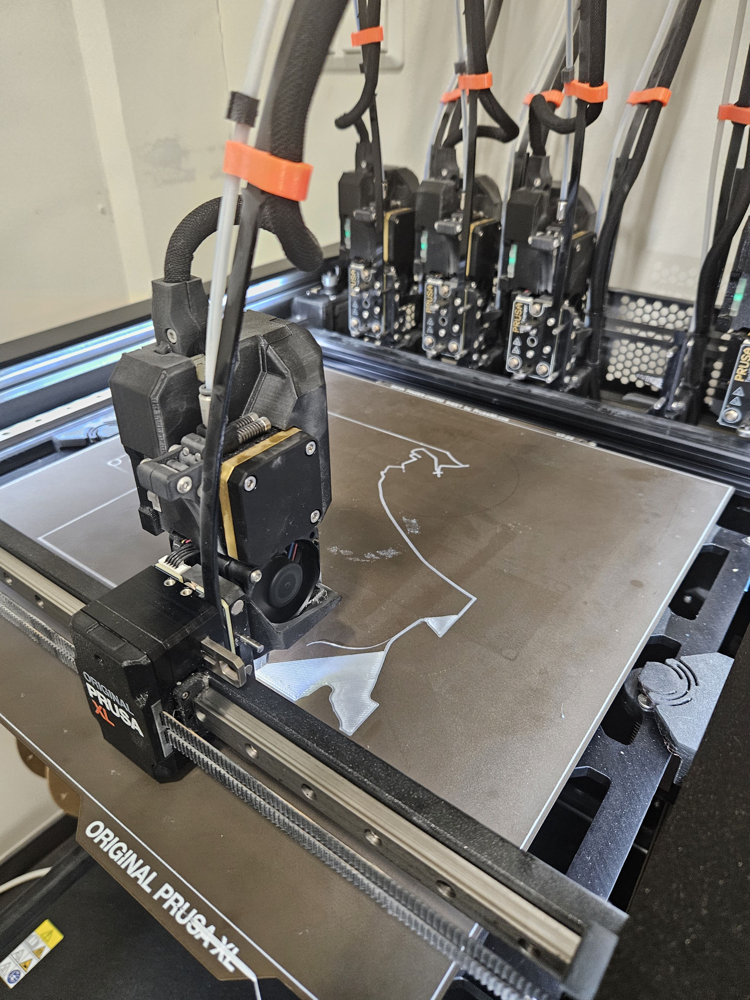
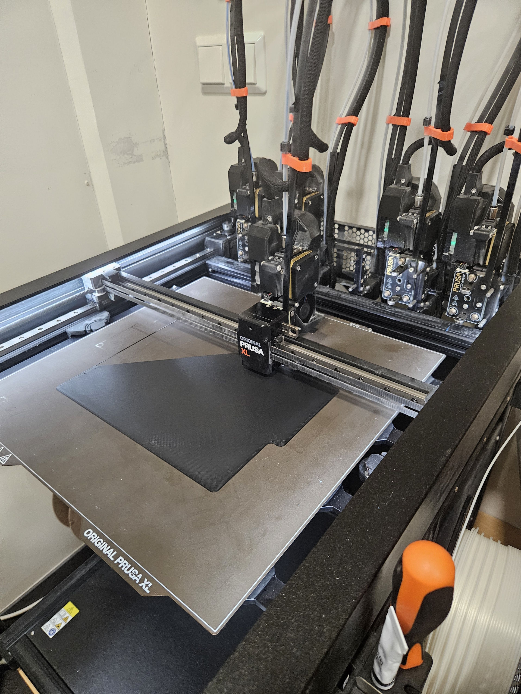

# 3D prentað bæjarlíkan

## Sauðárkrókur

Þetta verkefni snýst um að hanna þrívíddarmódel af Sauðárkróki og ramma í kringum hann. Notað eru forritin tinkercad og maps3d.io sem er forrit á netinu.
[Hlekkur að maps3d.io](https://maps3d.io/editor)

---

## Kveikjan að verkefninu

Hugmyndin spratt upp við uppgötvun á miklu magni af þrívíddarprentuðum módelum af borgum í Bandaríkjunum sem hægt er að finna á síðum eins og Makerworld.com og Printables.com. Við nánari athugun sást að þó að forrit væru til á netinu sem ætluð eru til að búa til módel af þessum toga þá eru þau nær eingöngu takmörkuð við Bandaríkin og í fáum tilfellum við Evrópu, eins og t.d. [map2model](https://map2model.com/). Því var ákveðið að finna upp á straumlínulaga og einföldu ferli til að búa til svipuð líkön af borgum og bæjum á Íslandi.

Dæmi um cityscape módel af [Makerworld](https://makerworld.com/en/models/106264-new-york-city-lower-manhattan-3d-miniature?from=search#profileId-115286)

## Verkferill
### Landlíkan og Mannvirki
Notast var við forritið [maps3d.io](https://maps3d.io/editor) sem er borgað forrit á netinu þar sem hægt er að hlaða niður þrívíddarskrám af landlíkönum. Í byrjun þarf að ákvarða svæðið sem að búa á til landlíkan af og er þar hægt að velja milli þriggja staðlaða forma (þ.e.a.s. kassi, hringur, og sexhyrningur) auk þess sem hægt er að teikna inn sín eigin form. Eftir að búið er að teikna inn svæðið er ýtt á "Generate 3D map" takkann. Athugið að einnig er hægt að stilla nákvæmlega stærð svæðisins í glugganum hægra megin.  

 

!!! info "Stillingar Verkefnis"

    Í þessu verkefni var ákveðið að taka ferhyrningslaga svæði af Sauðárkróki sem er 2,8km á hæð og breidd
  
Forritið sér þá um að draga fram gögn frá OpenStreetMap (sem er landmælingar gagnakerfi sem er notað mikið í kortagerð um allan heim) og nýtir þar hæðargögn til að skapa þrívíddarmódel af landinu á svæðinu sem var valið. Í stillingunum hægra megin er síðan hægt að leika sér með stillingarnar til að t.d. bæta við húsum, götum, ýkja ár, vötn, og sjó o.þ.h.  

  

Þegar að stillingarnar eru tilbúnar þá er hægt að ýta á "Export" takkann og hlaða módelinu niður eftir að greitt er fyrir það.
  
!!! info "Stillingar Verkefnis"

    Í þessu verkefni voru notaðar eftirfarandi stillingar:  
    **Terrain**  
    Elevation Exaggeration: 1,4  
    Ground Resolution: 62,8 meters  
    **Buildings**  
    Height Exaggeration: 2  
    Height Randomness: 30%  
    **Roads**  
    Extruded Height: 1 mm  
    Width Scale: 1,5 mm  
    **Water**  
    Render Mode: Surface

### Sjór og vötn dregin frá líkani
Módelinu var hlaðið inn í [Tinkercad](https://tinkercad.com) og stærð þess stillt á 22 cm á lengd og breidd, en þaðan var notast við Scribble skipunina til að teikna gróflega inn formin af vötnunum í kringum Sauðárkrók. Þeim formum voru síðan dregnar af landlíkaninu.  
Til að gera sjóinn (sem er með aðeins flóknara form heldur en vötnin) var tekið skjáskot af korti af svæðinu þar sem sjórinn er greinilegur. Sú mynd var síðan hlaðið inn í Inkscape þar sem henni var breytt yfir í vektor og sjórinn einangraður. Eftir það var sjóvektorinn hlaðið upp í Tinkercad og skalaður í rétta stærð. Þetta skref var þónokkuð mikil handavinna, en leitast var við að fá sem bestu nákvæmni á höfnina í norðurhluta bæjarins. Síðan er sjórinn dreginn frá landlíkaninu rétt eins og vötnin. Módelinu er síðan hlaðið niður.
!!! info "Vertu alveg viss"

    Gott er að fullvissa sig um að landlíkanið er fullkominn kassi með því að teikna frádráttar (hole) kassa í kringum líkanið og eyða þannig út u.þ.b. 1 mm af jöðrum módelsins.

### Slicing og útprentun
Notast var við Prusa XL - 5T Input Shaper prentara við útprentun á þessu tiltekna verkefni, en hvaða prentari með möguleikann á litabreytingum ætti að henta fyrir þetta verkefni. Landlíkaninu var hlaðið upp í forritið [Prusa Slicer](https://www.prusa3d.com/p/prusaslicer/), sem er slicer forrit þar sem hægt er að stilla prentstillingarnar fyrir prentverkið áður en það er sent í prentarann. Stillingarnar skipta gífurlega miklu máli hérna þar sem að hús og vegir eru mjög smágerðir og ef það er ekki sagt prentaranum að taka tillit til þess þá munu þau einfaldlega ekki prentast út. Í þessu verkefni voru eftirfarandi stillingar breyttar til að draga fram sem mest af smáatriðum módelsins:  
**Print Settings preset++: 0,10mm FAST DETAIL @XLIS 0.4  
**Layers and perimeters**  
***Layer height***  
Layer height: 0,05 mm  
First layer height: 0,1 mm  
***Vertical shells***  
Perimeters: 4  
***Quality***  
Extra perimeters if needed: enabled  
Detect bridging perimeters: enabled  
***Advanced***  
Seam Position: Rear  
Perimeter generation: Arachne  
**Infill**  
***Infill***  
Fill density: 40%  
Fill pattern: Adaptive Cubic  
**Advanced**  
***Arachne perimeter generator***  
Minimum perimeter width: 95%  
Minimum feature size: 1%  

Að lokum, þegar þessar stillingar eru klárar þá er módelið "slice'að" og það sett í prentarann. Í þessu tilviki tók módelið 18 klst og 13 min að prentast út, veig 160,76 g, og var prentað út í einungis hvítum lit af Polyterra PLA efni. Á meðan að landlíkanið var að prentast út var undirbúið rammann.
  
### Hönnun á ramma
Ramminn í þessu verkefni var hannaður í tinkercad og samanstóð af nokkrum kössum og fjórðungi úr "Tube" forminu sem notað var til að rúna hornin á módelinu. Gerður var kassi utan um módelið sem er 1 cm stærri en landlíkanið á lengd og breidd og hæð hans var síðan stillt á 5 mm. Stærð rammans var því 23 cm í tilviki þessa verkefnis. Síðan var dregið frá stærð módelsins svo að ferhyrningslaga hola, u.þ.b. 3 mm á dýpt, sem er nákvæmlega sama stærð og módelið myndist í miðju rammanns.Eftir það var bætt við litlu nafnspjaldi með nafni og öll horn rúnuð með fjórðung af Torus forminu. Síðan var rammanum hlaðið niður og fluttur í Prusa Slicer.

### Prentun á ramma
Prentstillingarnar á rammanum eru heldur auðveldari en á landlíkaninu, en helsta vandamálið sem fylgir rammanum er að það þarf að mála inn allar litabreytingar sem eiga að vera í módelinu sjálfu. Í þessu tilviki var botninn á holunni litaður blár fyrir sjó, ramminn er svartur, og textinn hvítur.  
Varðandi prentstillingar þá var notast við venjulegu preset prent stillinguna 0,20 mm STRUCTURAL, nema hvað infill var breytt í 10% gyroid pattern.
Eftir það var ramminn sendur í prentarann, í heild tók 2 klst og 8 min að prenta út rammann.

  
### Loka handtök
Í lokin var módelið skoðað og öll óhreinindi og lausir prentþræðir hreinsaðir. Síðan var módelinu ýtt í ramman og það fest saman með fáeinum dropum af superglue.

  
## Vandamál og Áskoranir
Nokkur vandamál komu upp meðan að á verkinu stóð yfir og verður hér farið yfir þau í stórum dráttum.
- Leitast var upprunalega eftir leið til að búa til landlíkan sem kostaði ekkert, en ekki var hægt að nálgast nægilega nákvæm hæðargögn á netinu til að búa til landlíkan í þessari smáu stærð. Var því endað á því að leitast eftir ódýrasta kostinum sem þó býður upp á sem mesta nákvæmni.
- Prentstillingar fyrir landlíkanið tóku mjög langan tíma og jafnvel þótt að stillt var prentarann eftir fremsta megni þá tapast ávallt gæði vegna stærðarinnar á prentstútnum sem í þessu tilviki var 0,4mm. Ef notast væri við smærri prentstút, eins og t.d. 0,2 mm eða 0,1 mm þá væri hægt að viðhalda þessum smáatriðum í landlíkaninu enn frekar.
- Prentaravesen þurfti auðvitað að láta á sér kræla og var eitt miklum tíma í stillingar og lagfæringar á prentaranum sem seinkaði verkefninu um heilan dag. Aukalega þá var prentað út eintak af landlíkaninu sem kom út furðulega gegnsætt miðað við veggjafjölda, ákveðið var að auka veggjafjölda, topp og botnfleti, og fyllingu til muna til að sporna gegn þessum gegnsæjanleika.
