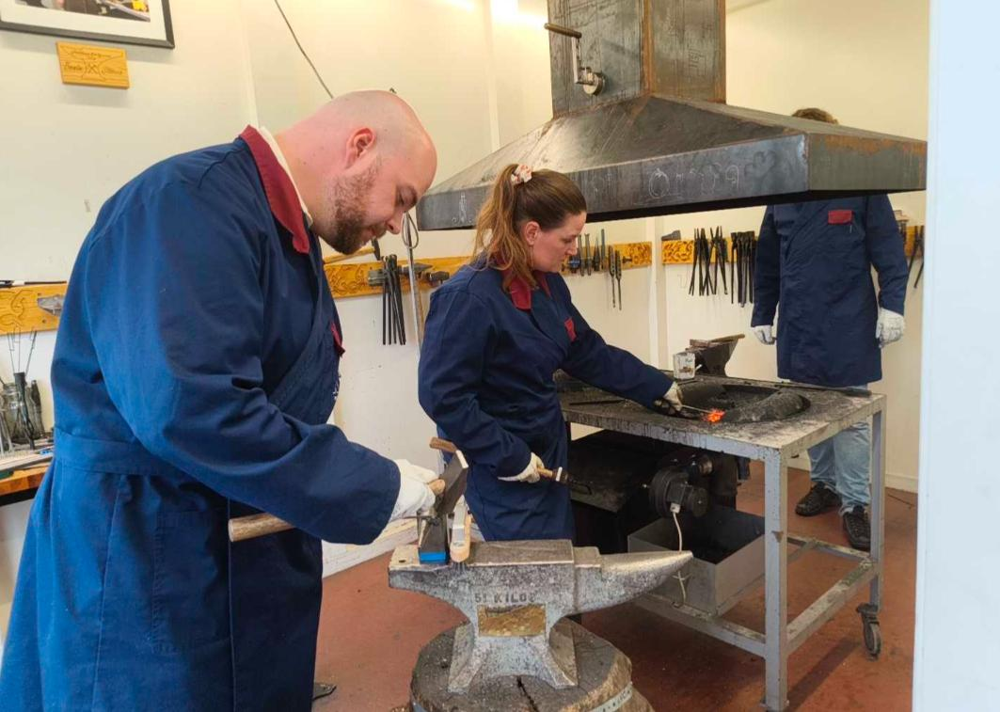
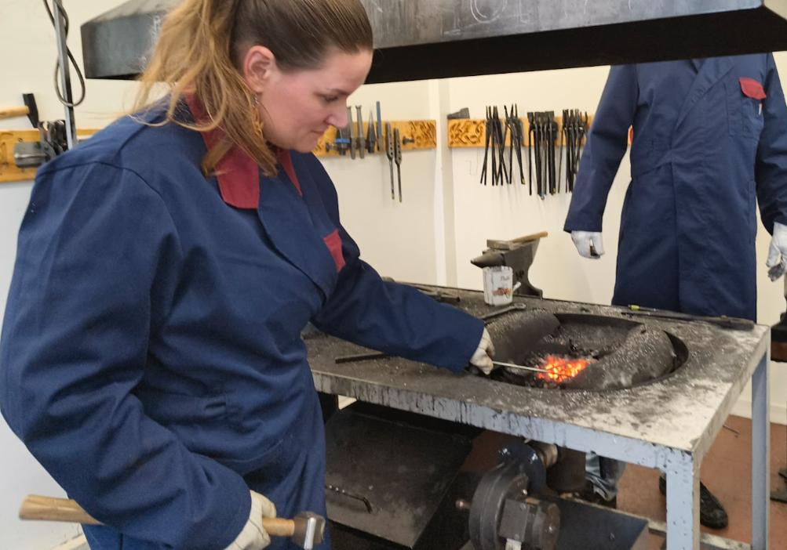
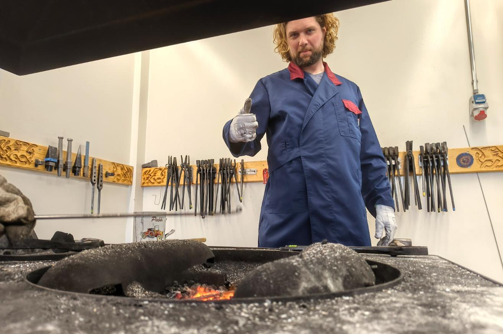

# Eldsmíði

NafnBjörn J. Sighvatz sem er Deildarstjóri málmiðn-, vélstjórnar og bíltæknigreina við FNV bauð upp á vinnustofu í eldsmíði. Hópurinn fékk tækifæri á að kynnars ýmsum fræðilegum og verklegum þáttum við vinnslu á málmum.

