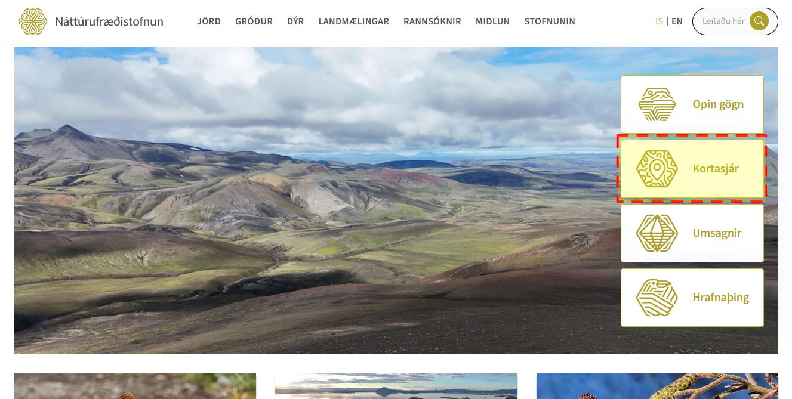

# Landslagsmódel með landmælingum Íslands, Qgis og Blender

Þetta verkefni snérist um að taka landmælingargögn frá náttúrufræðistofnun [Hlekkur](https://www.natt.is/is)
# Vefsíða náttúrufræðistofnunar

 
 
 Hægt er að fara inn í Kortasjá til þess að fá upp lista af mismunandi kortasjám nátt. 
 
 

Velja hæðalíkan. 
