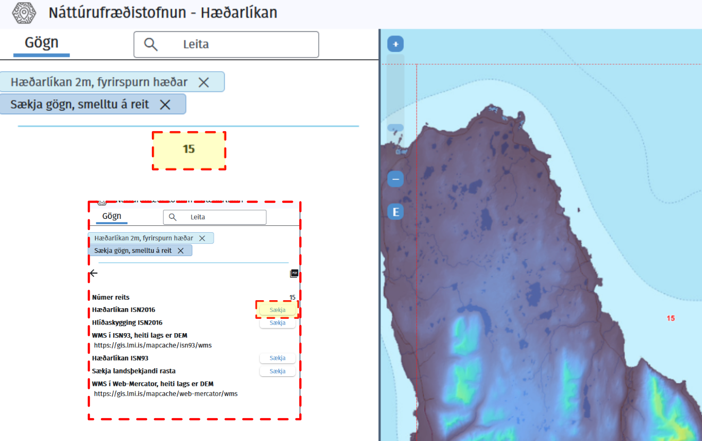

# Landslagsmódel með landmælingum Íslands, Qgis og Blender

Þetta verkefni snérist um að taka landmælingargögn frá náttúrufræðistofnun [Hlekkur](https://www.natt.is/is)

## Vefsíða náttúrufræðistofnunar

## Velja hæðalíkan.

Hægt er að fara inn í Kortasjá til þess að fá upp lista af mismunandi kortasjám nátt.
Velja "Hæðalíkan" kortasjá.

Þegar við erum inn í Hæðalíkan þá þarf að haka í "Sækja gögn, smelltu á reit"
Þá mun vinnuglugginn vinstra megin breytast þegar við smellum á reitinn sem við viljum sækja.

## Velja Reit.

Inn í Hæðalíka getum við valið okkur svæði í þessu tilfelli þá er ég að velja reit NR. 15
Sem að er Skagafjarðarsvæði. Það er hægt að sækja fleiri reiti og samtengja það seinna meir.

Þegar við höfum smellt á 15 í vinnuglugganum þá fáum við upp marga möguleika að sækja mismunandi gögn tengt þessu.
Smelltu á "Sækja" hliðin á "Hæðalíkan ISN2016"

Nú ættum við að hafa tif skjal með reitinum sem við völdum.
