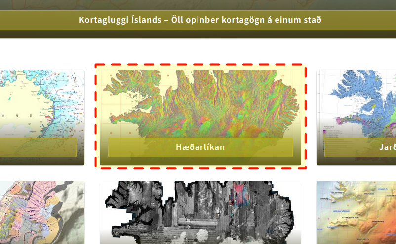
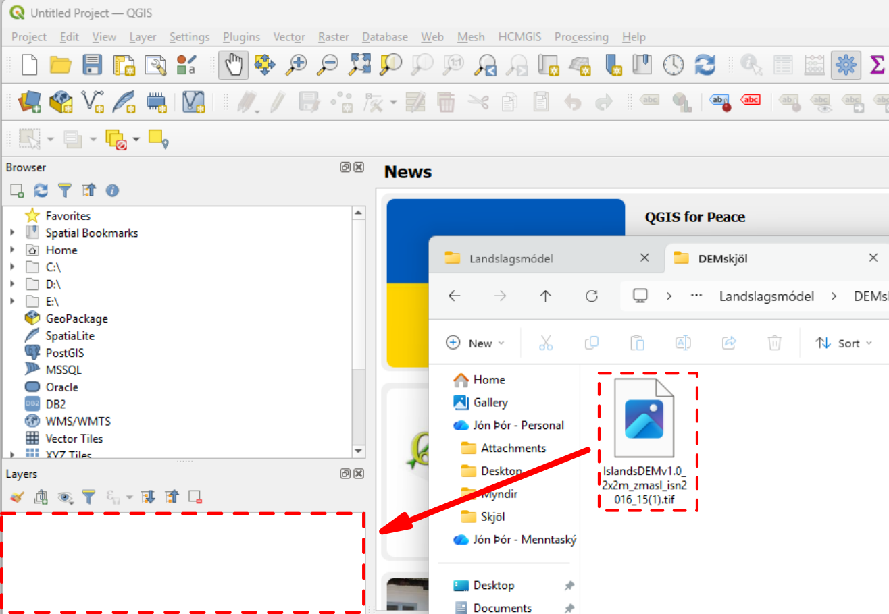
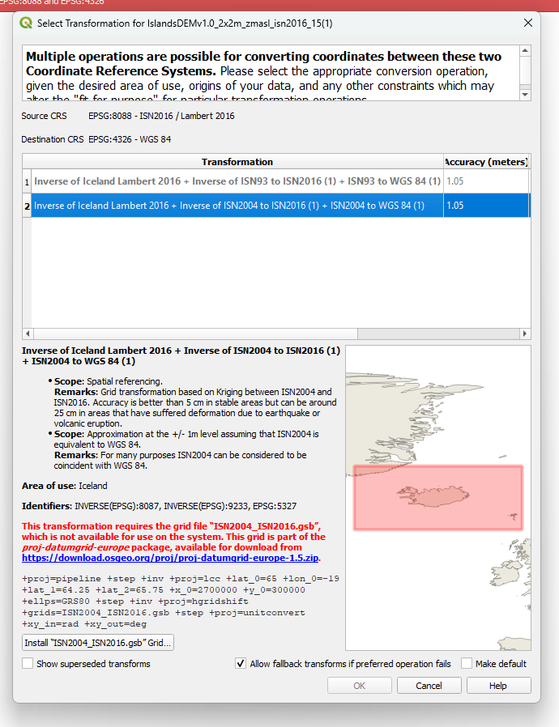
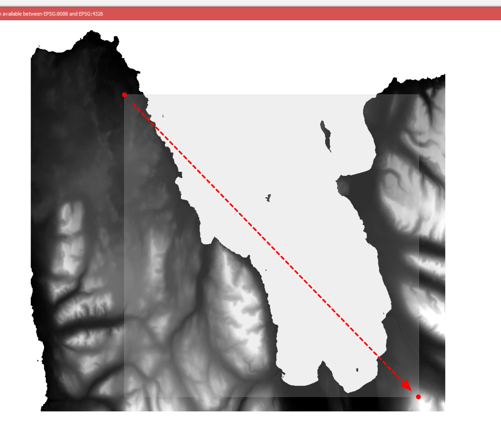
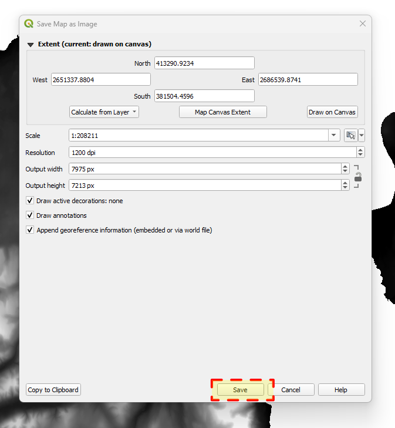

# Landslagsmódel með landmælingum Íslands, Qgis og Blender

Þetta verkefni snérist um að taka landmælingargögn frá náttúrufræðistofnun [Hlekkur](https://www.natt.is/is)

## Vefsíða náttúrufræðistofnunar

## Velja hæðalíkan.

Hægt er að fara inn í Kortasjá til þess að fá upp lista af mismunandi kortasjám nátt.
Velja "Hæðalíkan" kortasjá.

Þegar við erum inn í Hæðalíkan þá þarf að haka í "Sækja gögn, smelltu á reit"
Þá mun vinnuglugginn vinstra megin breytast þegar við smellum á reitinn sem við viljum sækja.

## Velja Reit.

Inn í Hæðalíka getum við valið okkur svæði í þessu tilfelli þá er ég að velja reit NR. 15
Sem að er Skagafjarðarsvæði. Það er hægt að sækja fleiri reiti og samtengja það seinna meir.

Þegar við höfum smellt á 15 í vinnuglugganum þá fáum við upp marga möguleika að sækja mismunandi gögn tengt þessu.
Smelltu á "Sækja" hliðin á "Hæðalíkan ISN2016"

Nú ættum við að hafa tif skjal með reitinum sem við völdum.

# QGIS

Qgis er korta forrit sem hægt er að nota til að setja DEM (digital elevation map) upplýsingar. 
DEM skjöl sem t.d. Tif skjalið sem þú sóttir inniheldur hæðarupplýsingar. 

## Setja .tif skjalið inn í Qgis

Hérna getur þú dregið .tif skjalið beint inn í Layers

Ef þessi error gluggi kemur upp þá má loka honum með því að ýta á X upp í hægra horninu. 

Nú getum við valið svæði sem við viljum af þessum reit og vistum út png mynd.
Við förum í Export map to image inn í Project - Export/import - Export map to image

MIKILVÆGT: dpi eða pát eru pixlafjöldi á myndinni sem þú ert að fara að vista. Þú vilt fá mikla nákvæmni og fjölda af 
pixlum svo að módelið sem þú erum að fara að búa til sé eins nákvæmt og hægt er. Ef þú hækkar ekki pixlafjöldan þá verður 
3d modelið mjög gróft. 1000 dpi ætti að virka vel en það sakar ekki að prófa sig áfram með þetta og byrja neðar meðan þú
ert að prófa þessa aðferð. Því hærri sem dpi fjöldinn er því þyngra verður það fyrir tölvuna að vinna með hana í Blender. 

Þegar þú ýtir á skref nr.3 að ofan þá hverfur glugginn og þú færð plús merki sem bendil. 
Þetta virkar eins og Snipping tool eða klippiverfærið í windows þar sem við teiknum yfir það svæði sem við viljum
með því að halda inni músinni og búa til kassa á það svæði sem við viljum. 

Nú máttu vista myndina með því að smella á "save" og velja staðsetningu í tölvunni sem þú veist hvar er. (gott er að búa til möppu fyrir öll skjölin á einum stað)

